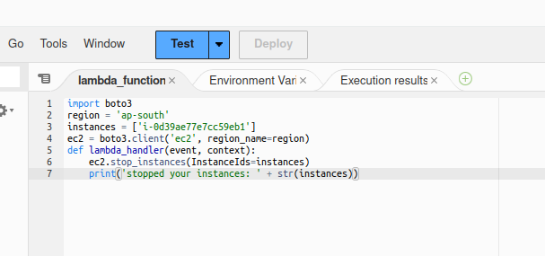
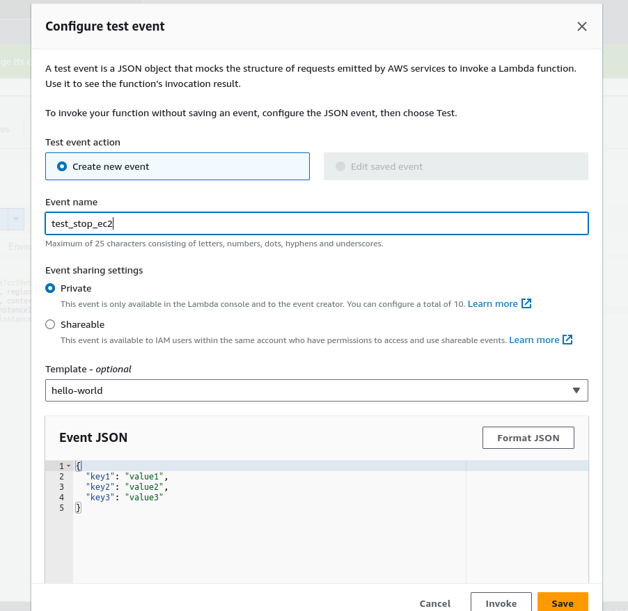
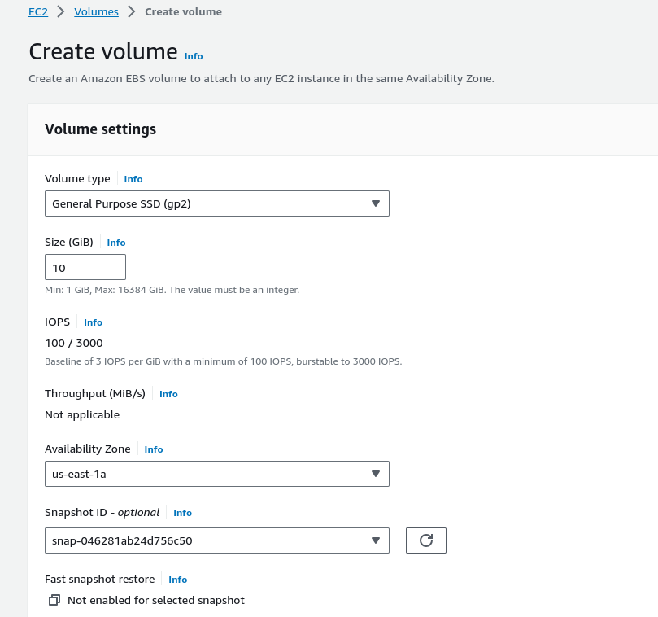
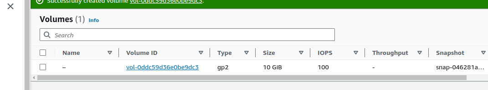

# Serverless Architecture

Q1:

#### Underlying lambda implementation



#### Test the working of the lambda function



#### Boto3 code to check the instance state

```python
import boto3

def lambda_handler(event, context):
    ec2 = boto3.client('ec2')
    
    
    stop_instances = ec2.describe_instances(Filters=[{'Name': 'tag:Action', 'Values': ['Auto-Stop']}])
    for reservation in stop_instances['Reservations']:
        for instance in reservation['Instances']:
            instance_id = instance['InstanceId']
            ec2.stop_instances(InstanceIds=[instance_id])
            print(f'Stopping instance: {instance_id}')
    
    start_instances = ec2.describe_instances(Filters=[{'Name': 'tag:Action', 'Values': ['Auto-Start']}])
    for reservation in start_instances['Reservations']:
        for instance in reservation['Instances']:
            instance_id = instance['InstanceId']
            ec2.start_instances(InstanceIds=[instance_id])
            print(f'Starting instance: {instance_id}')

    return {
        'statusCode': 200,
        'body': 'EC2 instances updated successfully!'
    }
```

Q2:

```python
import json
import boto3
from datetime import datetime, timedelta
def lambda_handler(event, context):
    s3 = boto3.client('s3')

    current_date = datetime.now()

    thirty_days_ago = current_date - timedelta(days=30)
    objects = s3.list_objects(Bucket='rams-stash')
    object_list = [obj['Key'] for obj in objects['Contents']]  
    if 'Contents' in objects:
        for obj in objects['Contents']:
            object_key = obj['Key']

            metadata = s3.head_object(Bucket='rams-stash', Key=object_key)
            metadata_tags = metadata.get('Metadata', {})
      
            if 'last-modified' in metadata_tags:
                last_modified_date = datetime.strptime(metadata_tags['last-modified'], '%Y-%m-%d')     
                if last_modified_date < thirty_days_ago:
                   
                    s3.delete_object(Bucket='rams-stash', Key=object_key)
                    print(f"Deleted object: {object_key}")
            if metadata_tags:
                print("Metadata Tags:")
                for key, value in metadata_tags.items():
                    print(f"  {key}: {value}")
```

Q3.





```python
import json
import boto3
from datetime import datetime, timedelta, timezone

def lambda_handler(event, context):
   
    ec2 = boto3.client('ec2')
   
    volume_id = 'vol-0ddc59d36e0be9dc3'
   
    snapshot = ec2.create_snapshot(
        VolumeId=volume_id,
        Description=f'Snapshot for EBS volume {volume_id}'
    )
  
    snapshot_id = snapshot['SnapshotId']
    print(f"Snapshot ID: {snapshot_id}")
    
   
    snapshots = ec2.describe_snapshots(Filters=[{'Name': 'volume-id', 'Values': [volume_id]}])

    
    thirty_days_ago = datetime.now(timezone.utc) - timedelta(days=30)    
    
   
    for snapshot in snapshots['Snapshots']:
        snapshot_id = snapshot['SnapshotId']
        snapshot_start_time = snapshot['StartTime']

        
        if snapshot_start_time < thirty_days_ago:
            
            ec2.delete_snapshot(SnapshotId=snapshot_id)
            print(f"Deleted Snapshot ID: {snapshot_id}")

        return {
        'statusCode': 200,
        'body': {
            'created_snapshot_id': snapshot_id,
            'deleted_snapshot_ids': [snapshot['SnapshotId'] for snapshot in snapshots['Snapshots'] if snapshot['StartTime'] < thirty_days_ago]
        }
    }
```
